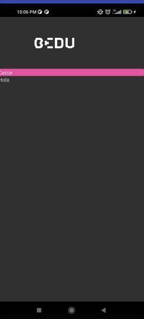

# Sesión 2 - Postwork

1. Terminada configuración de celular para desarrollo.

  

  

2. Se ha realizado el [fork](https://github.com/smendiet/Bedu-BackendNodeJs) del [Backend](https://github.com/igorariza/Bedu-BackendNodeJs)
3. Realizada la practica sobre layout con flexbox en [https://flexboxfroggy.com/#es](https://flexboxfroggy.com/#es)

