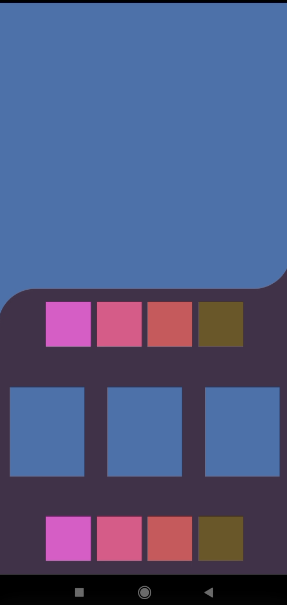
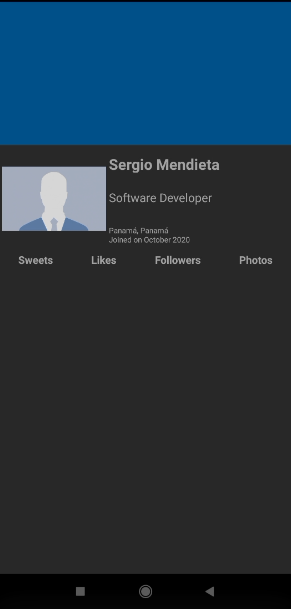
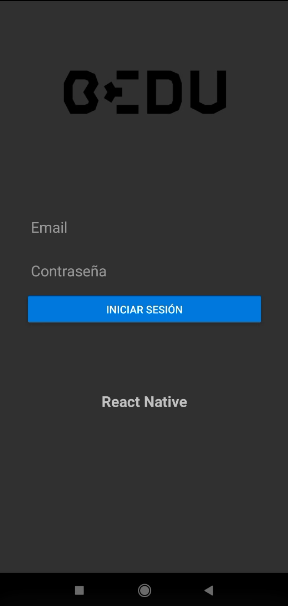

# Sesión 3 - Postwork

1. Terminar Challenge de Layout

2. Prácticar otros layout en [Github](https://github.com/tutsplus/get-started-with-react-native-layouts/) del [Get Started With Layouts in React Native](https://code.tutsplus.com/es/tutorials/get-started-with-layouts-in-react-native--cms-27418)

3. Realizar [Postwork de Layout](https://github.com/beduExpert/React-Native-2021/tree/main/Sesion-03/Postwork)

4. Realizar componente de Login

5. Realizar montaje del Backend