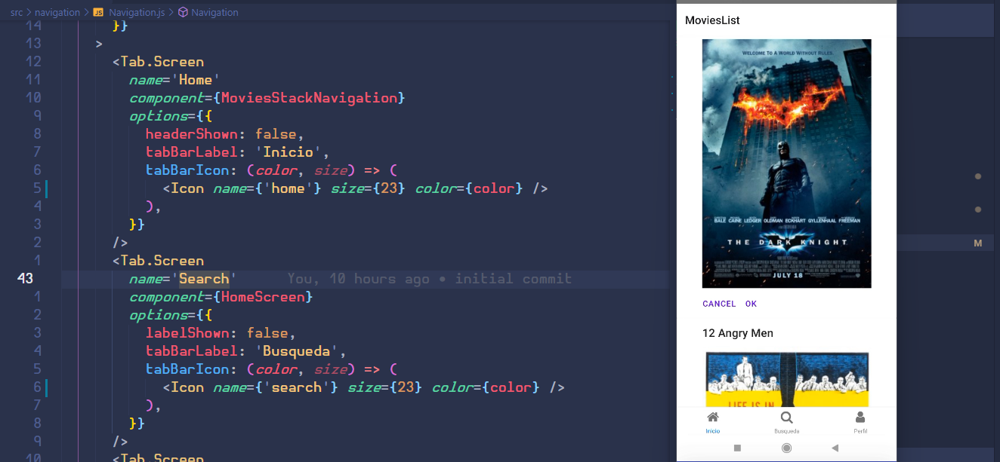

# Sesión 5 - Postwork

## Agregar iconos a proyecto

- Se realizaron las pasos los pasos de instalación de [react-native-vector-icons](https://github.com/oblador/react-native-vector-icons), android + manual

- Se procedio a configurar los iconos para cada menu

